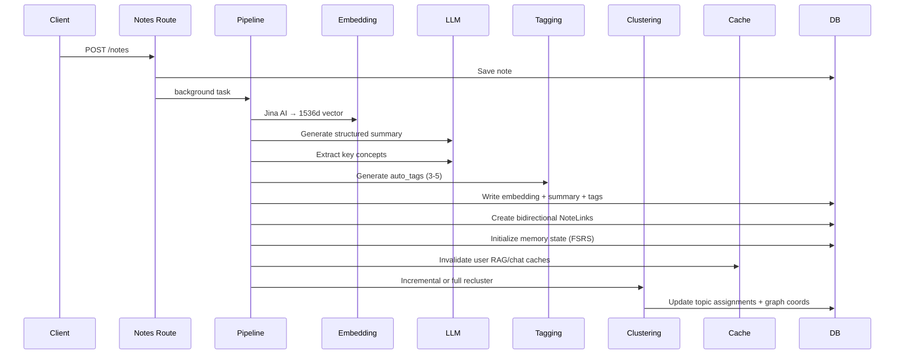
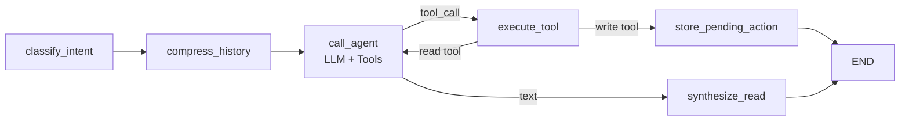

# MindVault Architecture

> **Version:** 1.0.0  
> **Stack:** FastAPI + React 18 + PostgreSQL (pgvector) + LangGraph  
> **Repository:** [pnp/officecli](https://github.com/pnp/officecli) (CLI for Microsoft 365 — separate project)

---

## 1. System Overview

MindVault is an **AI-Powered Knowledge Management System** — a "second brain" that ingests content (web pages, YouTube videos, voice notes, Slack and WhatsApp messages), automatically summarizes, tags, clusters, and links it. It exposes a **REST API**, an **MCP server** (Claude Desktop), a **Slack bot**, a **WhatsApp bot**, and a **React dashboard**.

```
┌──────────────────────────────────────────────────────────────────┐
│                        Clients & Interfaces                       │
│  ┌──────────┐  ┌──────────┐  ┌──────────┐  ┌──────────┐  ┌─────┐│
│  │ Web UI   │  │ Chrome   │  │ Claude   │  │ Slack    │  │Whats││
│  │ (React)  │  │ Ext.     │  │ Desktop  │  │          │  │App  ││
│  └────┬─────┘  └────┬─────┘  └────┬─────┘  └────┬─────┘  └──┬──┘│
│       │              │              │              │          │   │
│       ▼              ▼              ▼              ▼          ▼   │
│  ┌──────────────────────────────────────────────────────────┐    │
│  │                   FastAPI Backend                         │    │
│  │  ┌──────┐ ┌────────┐ ┌────────┐ ┌──────┐ ┌───────────┐  │    │
│  │  │Auth  │ │ Notes  │ │ Topics │ │Graph │ │ Agentic   │  │    │
│  │  │Routes│ │ Routes │ │ Routes │ │Routes│ │ Chat (LG) │  │    │
│  │  └──────┘ └────────┘ └────────┘ └──────┘ └───────────┘  │    │
│  │  ┌────────┐ ┌────────┐ ┌──────┐ ┌────────────────────┐  │    │
│  │  │Cache   │ │Revision│ │Eval  │ │  MCP Server        │  │    │
│  │  │Routes  │ │ Routes │ │Routes│ │  (FastMCP)         │  │    │
│  │  └────────┘ └────────┘ └──────┘ └────────────────────┘  │    │
│  └──────────────────────────────────────────────────────────┘    │
└──────────────────────────────────────────────────────────────────┘
                              │
                              ▼
┌──────────────────────────────────────────────────────────────────┐
│                     AI Service Layer                              │
│  ┌───────────┐ ┌──────────┐ ┌───────────┐ ┌───────────────────┐ │
│  │Embedding  │ │ LLM      │ │ Semantic  │ │ LangGraph Agents  │ │
│  │(Jina AI)  │ │ Routing  │ │ Cache     │ │ ┌─────────────┐   │ │
│  └───────────┘ └──────────┘ └───────────┘ │ │RAG Agent    │   │ │
│  ┌───────────┐ ┌──────────┐ ┌───────────┐ │ │(search→synth)│   │ │
│  │Clustering │ │ Pipeline │ │ Language   │ │ ├─────────────┤   │ │
│  │UMAP+HDBSCN│ │ Orchestr │ │ Detection  │ │ │Agentic Chat │   │ │
│  └───────────┘ └──────────┘ └───────────┘ │ │(read/write)  │   │ │
│                                           │ └─────────────┘   │ │
│  ┌───────────┐ ┌──────────┐ ┌───────────┐ └───────────────────┘ │
│  │Spaced     │ │ Tagging  │ │Scraper    │                       │
│  │Repetition │ │(LLM)     │ │(BS4)      │                       │
│  └───────────┘ └──────────┘ └───────────┘                       │
└──────────────────────────────────────────────────────────────────┘
                              │
                              ▼
┌──────────────────────────────────────────────────────────────────┐
│                    Data Layer (PostgreSQL + pgvector)             │
│  ┌──────────┐ ┌──────────┐ ┌───────────┐ ┌────────────┐        │
│  │ Users    │ │ Notes    │ │ Topics    │ │ NoteLinks  │        │
│  │ (Auth)   │ │(1536d vec)│ │(Centroid) │ │ (Bidi)    │        │
│  ├──────────┤ ├──────────┤ ├───────────┤ ├────────────┤        │
│  │ChatSess. │ │ChatMsgs  │ │SemCache   │ │MemState   │        │
│  │ + Msgs   │ │ + Cites  │ │(TTL)      │ │(FSRS)     │        │
│  ├──────────┤ ├──────────┤ ├───────────┤ ├────────────┤        │
│  │Revision  │ │EvalQueries│ │EvalRuns   │ │Pending    │        │
│  │ Sessions │ │          │ │           │ │AgentActions│        │
│  └──────────┘ └──────────┘ └───────────┘ └────────────┘        │
└──────────────────────────────────────────────────────────────────┘
```

---

## 2. Core AI Pipeline

When a note is created, the `process_note()` function orchestrates a fully async AI pipeline:



### 2.1 Ingestion Paths

| Source | Route | Input | Processing |
|--------|-------|-------|------------|
| **Manual / Web Extension** | `POST /notes` | HTML or text | BS4 extraction → pipeline |
| **YouTube Video** | `POST /notes/youtube` | URL (+ optional pre-fetched transcript) | yt-dlp metadata → captions/Whisper → pipeline |
| **YouTube Summary** | `POST /notes/youtube-summarize` | Client-extracted transcript | Bypasses server-side YouTube blocking |
| **Audio (Voice Notes)** | `POST /notes/audio` | MP3/WAV file | Groq Whisper → pipeline |
| **MCP Tool** | MCP `add_note` | Text + user_id | Direct → pipeline |
| **Slack DM** | `POST /slack/events` | Message text | Intent routing → pipeline or RAG |
| **WhatsApp** | `POST /whatsapp/webhook` | Message text (Twilio form) | Signature check → intent routing → pipeline or RAG |

---

## 3. AI Service Components

### 3.1 Embedding Service (`services/embedding.py`)

- **Provider:** Jina AI (`jina-embeddings-v3`)
- **Dimensions:** 1536 (padded/truncated for pgvector compatibility)
- **Client:** OpenAI-compatible SDK via `wrap_openai` (LangSmith tracing)

```python
async def get_embedding(text: str) -> list[float]:
    text = text[:8000]                     # chunk limit
    response = await client.embeddings.create(input=text, model="jina-embeddings-v3")
    # Pad or truncate to 1536
```

### 3.2 LLM Service (`services/llm.py`)

**Smart Multilingual Routing with Fallback:**

```
┌─ Query ─┐
     │
     ▼
┌─ Language Detection (langdetect) ─┐
     │
     ├── Indic (hi, ta, te, kn, bn, ...)
     │   ├── 1° Gemini (gemini-1.5-flash)
     │   ├── 2° Sarvam (sarvam-2b)
     │   └── 3° Groq 8b (llama-3.1-8b-instant)
     │
     └── English
         ├── 1° Groq 70b (llama-3.3-70b-versatile)
         └── 2° Groq 8b (llama-3.1-8b-instant)
```

Fallback triggers on `429`/`quota`/`rate limit` errors.

**Task-Specific LLM Functions:**

| Function | Cache Key | TTL | Purpose |
|----------|-----------|-----|---------|
| `generate_summary()` | `summary` | 24h | JSON structured summary (overview, detailed, insights, concepts) |
| `extract_concepts()` | `concepts` | 24h | Key entities extraction |
| `synthesize_answer()` | `rag` | 6h | RAG question answering |
| `generate_tags()` | `tags` | 48h | Auto-tagging (3-5 tags) |
| `generate_topic_name()` | `topic_name` | 72h | Cluster naming (2-5 words) |
| `summarize_youtube_video()` | `summary` | 24h | YouTube transcript summarization |

### 3.3 Semantic Cache (`services/semantic_cache.py`)

- **Storage:** pgvector (1536d) on `semantic_cache` table
- **Lookup:** Cosine similarity ≥ 0.80 threshold
- **TTL:** Per cache key (summary=24h, tags=48h, topic=72h, rag=6h, chat=1h)
- **Invalidation:** On note create/update/delete (scoped to user + key)
- **Startup cleanup:** Expired entries deleted on boot

```sql
SELECT response FROM semantic_cache
WHERE cache_key = :key
  AND (query_embedding <=> :emb) >= 0.80
  AND expires_at > NOW()
  AND user_id = :uid
ORDER BY query_embedding <=> :emb
LIMIT 1;
```

### 3.4 Clustering Service (`services/clustering.py`)

**Hybrid Dimensionality Reduction + HDBSCAN Pipeline:**

```
X (n_notes × 1536)
  │
  ├── n < 5 ──► All to cluster 0 (tiny vault)
  │
  ├── n < 100 ──► PCA → HDBSCAN → PCA-2D
  │                (~10ms, ~10MB RAM)
  │
  └── n ≥ 100 ──► UMAP → HDBSCAN → UMAP-2D
                   (~30s, low_memory mode)
```

- **Clusterer:** HDBSCAN (handles noise/outliers via label=-1)
- **Min cluster size:** `max(2, n // 15)`
- **Recluster threshold:** Every 20 new notes triggers a full recluster
- **Incremental:** New notes predicted via `approximate_predict()` on cached clusterer
- **Dedicated executor:** `ThreadPoolExecutor(max_workers=1)` to avoid GIL contention
- **Dedicated DB engine:** `pool_size=2` so clustering never starves main pool
- **Output:** Topic assignments + 2D graph coordinates (`graph_x`, `graph_y`)

### 3.5 Knowledge Graph (`routes/graph.py`)

The graph API returns an Obsidian-level knowledge graph payload:

```
Nodes:
  ├── Topic nodes (color-coded, positioned at centroid of member notes)
  └── Note nodes (with graph_x/y, degree, color_index)

Links:
  ├── topic_link   (topic → its member notes)
  ├── semantic_link (pgvector cosine similarity ≥ 0.75)
  └── backlink     (bidirectional NoteLink records)
```

### 3.6 Spaced Repetition (`services/spaced_repetition.py` + `services/revision_selector.py`)

**FSRS-Inspired Algorithm:**

- **Initial state:** stability=1.0, interval=1 day, retention=1.0
- **Ratings:** `forgot` / `hard` / `good` / `easy`
- **Stability multipliers:** 0.5× / 1.2× / 2.0× / 3.0×
- **Max interval:** 180 days
- **Mastered threshold:** 60 days interval
- **Retention formula:** `e^(-days_since_review / stability)`
- **Priority scoring:** 40% forgetting score + 30% overdue + 15% new + 15% low stability
- **Selection:** Top 5 notes, topic-diverse (1 per topic), backfilled if needed
- **Cron:** APScheduler runs `update_retention_scores()` nightly at midnight
- **Inline refresh:** Also runs on every `/notes` list call (10-min debounce)

---

## 4. LangGraph Agents

### 4.1 RAG Agent (`services/agent.py`)

**Simple Search → Synthesize (2 nodes, 1 LLM call):**

```
State: { query, retrieved_notes[], final_answer, sources[], user_id }

  search_node ──► synthesize_node ──► END
```

- **search_node:** pgvector cosine similarity (top-5, user-scoped)
- **synthesize_node:** LLM generates structured JSON answer with citations
- **Security:** user_id is required and validated — no global unscoped queries

### 4.2 Agentic Chat (`services/agentic_chat.py`)

**Multi-node LangGraph with Read/Write Workflow:**



**Tools:**

| Tool | Type | Purpose |
|------|------|---------|
| `search_vault` | Read | Semantic search (top-5) |
| `read_note` | Read | Full note content by UUID |
| `propose_create_note` | Write | Preview only → pending |
| `propose_update_note` | Write | Preview with diff → pending |
| `propose_delete_note` | Write | Preview → pending |

**Context Compression:**

- **Stage 1:** Strip stale `ToolMessage` results (keep only most recent round)
- **Stage 2:** LLM-summarize oldest 50% of turns when token estimate > 6000

**Write Safety:** All write operations return `PendingAgentAction` records with 5-minute TTL. The frontend must explicitly call `POST /api/agent/confirm/{token}` with `approved=true` to execute.

### 4.3 Messaging Bots (`routes/slack.py`, `routes/whatsapp.py`)

Both channels share the same shape. Only identity resolution and the reply
transport differ — intent classification and everything downstream is identical.

```
Inbound message ──► Verify sender signature
                         ↓
                    Resolve identity → User
                         ↓
                    Intent Router (LLM, services/intent.py)
                       ├── "SAVE_NOTE"      ──► Create Note ──► Pipeline
                       └── "SEARCH_OR_CHAT" ──► RAG Agent ──► answer + sources
```

| | Slack | WhatsApp |
|---|---|---|
| Transport | slack-bolt Events API | Twilio webhook (form-encoded) |
| Signature | `slack_signing_secret` | `X-Twilio-Signature` HMAC |
| Identity | `users.slack_user_id` (stores **team** id — one shared vault per workspace) | `users.phone_number` (E.164, per person) |
| Provisioning | Auto-creates a workspace user on first message | **Never auto-creates** — unlinked numbers get setup instructions |
| Linking | `link workspace email@example.com` in-channel | From the web app: `POST /auth/phone` (Firebase-authenticated) |
| Reply | `say()` — can post multiple times inline | Webhook acks immediately; answer pushed via Twilio REST |

**Why WhatsApp replies asynchronously.** Twilio expects a webhook response within
~10 seconds, but embedding + LLM synthesis routinely exceeds that. The webhook
returns empty TwiML immediately and `asyncio.create_task` handles classification,
retrieval, and the outbound push. Slack doesn't need this because `say()` can be
called repeatedly on an open connection.

**Why linking happens in the web app.** Identity is already proven by the Firebase
token there, so no OTP round trip is needed and an unknown number can never claim
a vault. `phone_number` is `UNIQUE`, so auto-provisioning would let a wrong number
permanently squat a real one.

**Shared services** (`services/whatsapp.py`):
- `normalize_phone()` — E.164 normalization; strips `whatsapp:` prefix, spaces, dashes; bare 10-digit numbers assume `+91`
- `verify_twilio_signature()` — rebuilds the signed URL from `X-Forwarded-Proto`/`X-Forwarded-Host` so proxied TLS (Render, Cloudflare) doesn't break the HMAC
- `send_whatsapp_message()` — outbound REST; the Twilio SDK is synchronous, so it runs via `asyncio.to_thread`

### 4.4 MCP Server (`mcp_server.py`)

Exposes 7 tools via FastMCP for Claude Desktop integration:

| Tool | Description |
|------|-------------|
| `search_vault` | Semantic search across vault |
| `add_note` | Create note + trigger pipeline |
| `get_related` | Get linked notes |
| `list_topics` | List topic clusters |
| `summarize_topic` | AI summary of a topic |
| `chat_with_vault` | Full RAG agent conversation |
| `get_due_reviews` | Spaced repetition queue |

---

## 5. Data Model

### 5.1 Core Tables

| Table | Key Columns | Purpose |
|-------|-------------|---------|
| `users` | firebase_uid, email, slack_user_id, phone_number | Authentication & identity |
| `notes` | embedding(1536d), topic_id, auto_tags, user_tags, summary | Knowledge artifacts |
| `note_links` | source_id, target_id, similarity_score | Bidirectional semantic edges |
| `topics` | cluster_id, centroid(1536d), note_count | HDBSCAN clusters |
| `chat_sessions` | user_id, title, is_pinned | Chat conversations |
| `chat_messages` | session_id, role, content, cited_note_ids | Message history |
| `semantic_cache` | query_embedding(1536d), cache_key, response, user_id, expires_at | LLM response cache |
| `note_memory_state` | note_id, user_id, stability, estimated_retention, interval_days | Spaced repetition |
| `revision_sessions` | user_id, date, notes_due, notes_completed | Daily review tracking |
| `pending_agent_actions` | user_id, action_type, payload, expires_at | Write confirmation queue |
| `eval_queries` | query_text, expected_note_id, query_type | Retrieval evaluation |
| `eval_runs` | user_id, precision_at_3, avg_similarity, gate_passed | Evaluation results |
| `retrieval_logs` | user_id, query_text, notes_returned, avg_similarity | Live search logging |
| `result_votes` | user_id, query_text, note_id, vote | Human relevance feedback |

---

## 6. Search Architecture

**Hybrid Search** combining vector similarity and BM25 full-text with RRF (Reciprocal Rank Fusion):

```mermaid
flowchart LR
    Q[Query] --> E[Embedding<br/>Jina AI]
    Q --> FTS[Full-Text<br/>BM25/tsvector]
    E --> V[pgvector<br/>cosine similarity]
    FTS --> B[ts_rank]
    V --> RRF[RRF Fusion<br/>score = 1/(60+rank)]
    B --> RRF
    RRF --> TOP[Top-K results]
    TOP --> RAG[Optional RAG<br/>synthesis]
```

- **RRF Constant:** k=60
- **Vector threshold:** 0.50 similarity
- **Top-K fetch:** 3× requested count (candidates)
- **Optional RAG:** LangGraph agent synthesizes answer from top results

---

## 7. Frontend Architecture (React 18 + Vite)

```
frontend/src/
├── pages/
│   ├── LoginPage.jsx         — Firebase auth / OTP login
│   ├── VaultPage.jsx         — Note listing + filters + create
│   ├── NotePage.jsx          — Single note view + backlinks
│   ├── SearchPage.jsx        — Hybrid search + RAG results
│   ├── TopicsPage.jsx        — Knowledge graph (D3.js/vis)
│   ├── ChatPage.jsx          — Agentic chat with write confirmations
│   └── RevisionPage.jsx      — Spaced repetition review flow
├── components/
│   ├── GraphView.jsx         — Interactive knowledge graph
│   ├── ChatPanel.jsx         — Chat interface
│   ├── SearchPanel.jsx       — Search filters + results
│   ├── RichTextEditor.jsx    — TipTap-based note editor
│   ├── RevisionCard.jsx      — Flashcard-style review card
│   └── SettingsModal.jsx     — User settings
├── context/
│   └── AuthContext.jsx       — JWT/Firebase auth state
└── api.js                    — Axios client
```

### 7.1 Page Routes

| Route | Component | Purpose |
|-------|-----------|---------|
| `/login` | LoginPage | Auth (credentials or OTP) |
| `/` | VaultPage | Note grid/filters |
| `/revision` | RevisionPage | Spaced repetition |
| `/topics` | TopicsPage | Knowledge graph |
| `/note/:id` | NotePage | Detail with backlinks |
| `/search` | SearchPage | Hybrid search + RAG |
| `/chat` | ChatPage | Agentic chat |
| `/ai-store` | AIStorePage | Prompt marketplace |

---

## 8. Chrome Extension

```
extension/
├── popup.html/css/js    — Browser popup UI (save page / YouTube)
├── background.js        — Service worker (relay to API)
├── content.js           — Content script (page extraction)
│   ├── Readability.js   — Article parsing
│   ├── extractYoutubeTranscript()  — 3-method YouTube extraction
│   └── chrome.runtime.onMessage    — GET_PAGE_CONTENT / GET_YOUTUBE_TRANSCRIPT
└── manifest.json        — V3 manifest
```

### YouTube Transcript Extraction (3 Methods)

1. **`ytInitialPlayerResponse`** — Parse YouTube's `#movie_player.getPlayerResponse()` → caption tracks
2. **`timedtext` API** — Direct API fallback (`youtube.com/api/timedtext?`)
3. **Description fallback** — Title + description when no captions available

---

## 9. Retrieval Evaluation System

- **`eval_queries`:** Golden dataset (hand-curated query → expected note)
- **`eval_runs`:** Per-run metrics (precision@3, avg similarity, zero-result rate)
- **`retrieval_logs`:** Always-on live search logging
- **`result_votes`:** Thumbs up/down per result per query per user
- **Gate:** `gate_passed` boolean prevents regression deployments

---

## 10. Infrastructure

### 10.1 Docker

```yaml
services:
  db:          # PostgreSQL 16 + pgvector
  backend:     # FastAPI + uvicorn
  frontend:    # Vite dev server with HMR
```

### 10.2 Environment Config (`config.py`)

| Variable | Purpose |
|----------|---------|
| `embedding_provider` | jina / openai / gemini |
| `llm_provider` | groq / openai / gemini |
| `auth_method` | credentials / otp |
| `cache_similarity_threshold` | 0.80 default |
| `recluster_every_n` | 20 notes |
| `chat_compression_threshold` | 6000 token estimate |
| `REVISION_THRESHOLD` | 5 notes per day |
| `MAX_INTERVAL_DAYS` | 180 |
| `MASTERED_THRESHOLD_DAYS` | 60 |

---

## 11. Security & Scoping

- **User isolation:** Every DB query includes `WHERE user_id = :uid`
- **Note ownership:** All CRUD checks `note.user_id != current_user.id`
- **Write confirmation:** Agent must create `PendingAgentAction` (5-min TTL) for all mutations
- **Rate limiting:** `slowapi` rate limiter on auth routes
- **CORS:** Wide-open for dev (extension + dashboard), tighten in production
- **Auth bypass:** Mock auth for local dev (`firebase_uid: "mock-local-user-1"`)
- **Webhook signatures:** `/whatsapp/webhook` verifies `X-Twilio-Signature` (HMAC over URL + params) and returns 403 otherwise; `/slack/events` uses slack-bolt's signing-secret verification
- **No phone auto-provisioning:** `users.phone_number` is `UNIQUE`; unlinked numbers receive setup instructions and never create an account. Linking requires a Firebase-authenticated `POST /auth/phone`

**Known gaps** (see the identity comparison in §4.3):

- `/mcp` has **no authentication** — `user_id` is a tool argument validated only for UUID *format*, so anyone with a UUID can read or write that vault. Authenticate the connection and derive `user_id` server-side before exposing it publicly.
- `read_note` (`services/agent_tools.py`) and the update/delete branches of `POST /api/agent/confirm/{token}` select notes by id **without** a `user_id` filter.
- `search_vault` takes `user_id` as an LLM-supplied argument rather than injecting it via `config["configurable"]` as the DB session already is.

---

## 12. Monitoring (LangSmith)

- **Tracing:** All LLM calls, embeddings, agents, and pipeline steps decorated with `@traceable`
- **Metadata:** User ID, query text, RAG confidence, cache hits/misses attached per run
- **Project:** `MindVault` on LangSmith
- **Config:** `.env` → `LANGCHAIN_API_KEY`, `LANGCHAIN_PROJECT`

---

## 13. Key Design Decisions

| Decision | Rationale |
|----------|-----------|
| **Jina AI for embeddings** | 8192 token context, 1536d vectors, OpenAI-compatible API |
| **HDBSCAN over KMeans** | Native noise/outlier handling, no fixed K parameter |
| **PCA fallback for small vaults** | UMAP is too slow/overkill for <100 notes |
| **Separate clustering DB pool** | Prevents HDBSCAN from starving main app connections |
| **Client-side YouTube transcripts** | Cloud IPs are blocked by YouTube; extension extracts locally |
| **LLM fallback chain** | Rate limits are inevitable; graceful degradation is critical |
| **RRF hybrid search** | Combines semantic + keyword without tuning weights |
| **Semantic cache with pgvector** | Reuses same index; no additional infrastructure |
| **PendingAction write safety** | LLMs hallucinate IDs; user must confirm all mutations |
| **FSRS-inspired spaced repetition** | Proven algorithm (Anki's FSRS) adapted for knowledge retention |